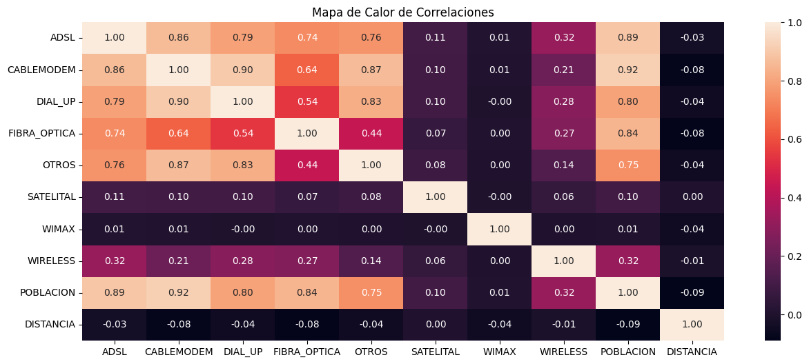
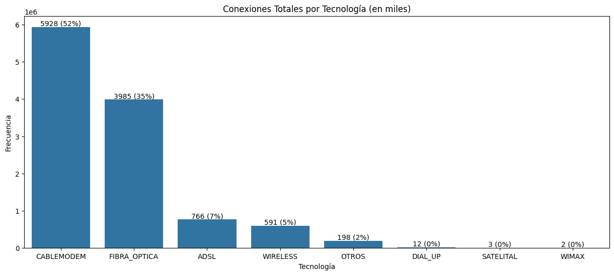
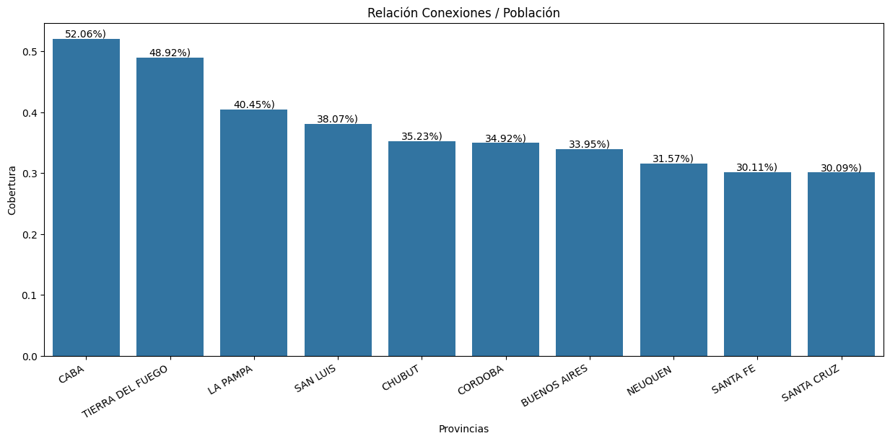
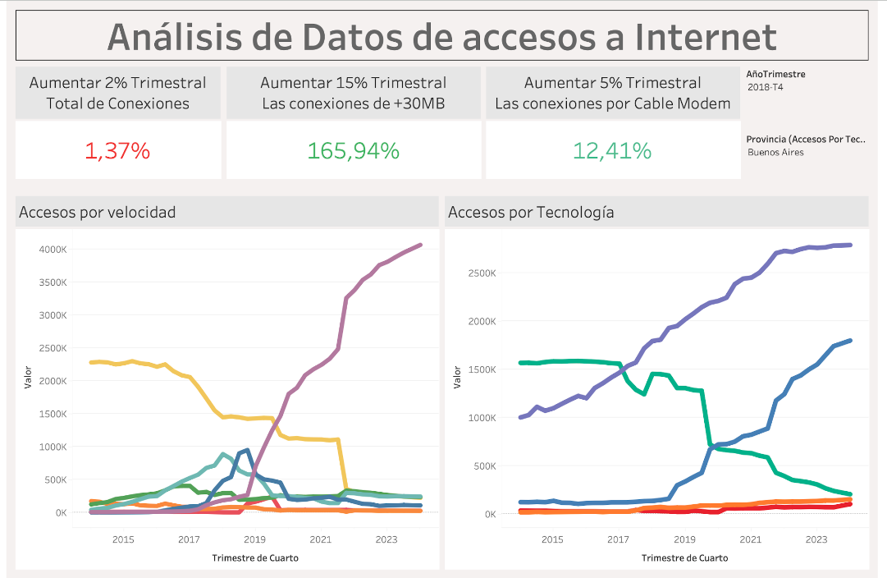

<h1 align='center'>
   <b>Análisis de datos: accesos a Internet</b>
</h1>

   

## Descripción

Este proyecto tiene como objetivo analizar los datos relacionados a las telecomunicaciones en Argentina con el fin de identificar el comportamiento y encontrar oportunidades y mejoras para una empresa cuyo principal servicio se caracteriza por brindar acceso a internet.

## Tabla de contenido

1. [Introducción](#introducción)
2. [Estructura del Proyecto](#estructura-del-proyecto)
3. [ETL y EDA](#etl-y-eda)
4. [Dashboard](#dashboard)
5. [Resultados y Conclusiones](#resultados-y-conclusiones)
6. [Contribución y Colaboración](#contribución-y-colaboración)

## Introducción

Para llevar acabo este proyecto se tomaron los datos disponibles en la web de Enacom. El análisis se basó principalmente en el dataset llamado [internet](https://indicadores.enacom.gob.ar/Files/Datos_Abiertos/Internet.xlsx), del cual se utilizaron datos de las siguientes hojas:

- Accesos_tecnologia_localidad
- Accesos Por Tecnología
- Totales Accesos Por Tecnología
- Totales Accesos por velocidad

Por otra parte se tomaron datos del dataset [mapa conectividad](https://indicadores.enacom.gob.ar/Files/Datos_Abiertos/mapa_conectividad.xlsx). Del cual se tomó informacion relacionada con la población y la ubicación geográfica.

## Estructura del Proyecto

- `data/`: Contiene los archivos de datos utilizados en el proyecto.
- `ETLEDA.ipynb/`: Incluye el preceso ETL y el EDA sobre los datasets seleccionados.
- `README.md`: Archivo de documentación del proyecto.
- `dashboard.twbx`: Contiene el dashboard en formato de Tableau empaquetado.

## ETL y EDA

Toda la información relacionada con el ETL y con el EDA se encuentra documentada en el documento específico para ello: [ETLYEDA](./ETLEDA.ipynb)

### Puntos importantes sobre el ETL:

Después de un primer analisis exploratorio de alto nivel se decidió realizar el ETL sobre las hojas de `Accesos_tecnologia_localidad` del dataset `Internet.xlsx` y el dataset `mapa_conectividad.xlsx`.

- Se analizaron valores nulos y faltantes.
- Se validó la posibilidad de utilizar el campo `Link Indec`como clave y resultó que habian valores duplicados.
- Finalmente se decidió uutilizar los valores `PROVINCIA` ,`PARTIDO` y `LOCALIDAD` como clave.
- Se realizaron algunos ajustes para compatibizar los nombres de `CABA` y  `Capital Federal`
- Se eligió la comuna de CABA mas poblada como centro geográfico y se calculó, como un nuevo campo, la distancia de cada localidad con el "centro".
- Finalmente se hizo un merge entre ambos datasets, se observó que habia um poco mas de 100 localidades que no matcheaban y resultaron ser aquellas que se habian denominado como 'OTROS'.

---

### Puntos importantes sobre el EDA:

Se utilizó el dataset obtenido en el ETL para el desarrollo del EDA.

#### <u>Tipos de Variables</u>

Con respecto al tipo de variable tenemos:

- **Categóricas**: provincia, partido y localidad
- **Numericas**: todas las demás

#### <u>Estudio de la correlación</u>

Hay una correlación entre la poblacion y las tecnologias de fibra óptica, cablemodem y adsl

**podriamos analizar el promedio poblacional que tienen una cantidad de conexiones igual o superior a la media**

La distancia al centro de la capital no señala ninguna correlacion con ninguna de las tecnologías

---
#### <u>Frecuencia de cada tecnología a nivel Pais</u>

**Se observa claramente que las tecnologías predominantes son Cable Módem y Fibra Óptica con el 87% de las conexiones**

---
#### <u>Relación entre conexiones y población por provincia</u>

**Se observan las provincias que mayor relacion presentan entre cantidad de conexiones y su poblacion, apenas una llega al 50% Se podria pensar que hay mucho por desarrollar**

---
#### <u>Análisis de las medidas de tendencia central, segmentdas por Localidad, Partido y Provincia</u>

Luego se agruparon los datos por Partido para poder cacular la corbertura desde esa óptica y finalmente se organizaron en una tabla dos datos de las medidas centrales:

| Area      |  min  |   25%   | Mediana |   75%   | Max       | Promedio |  Moda  | Desvío E. | Coef. Var (%) |
| :---------- | :------: | :-------: | :-------: | :-------: | ----------- | ---------- | :------: | :----------: | :-------------: |
| Localidad |   1   |   29   |   170   |  1.058  | 1.504.711 | 3890     |   1   |   32.370   |      12      |
| Partido   |   1   |   633   |  3185  | 13.135 | 1.504.711 | 22.472   |   4   |   81.741   |      27      |
| Provincia | 61.555 | 114.136 | 161.052 | 270.179 | 4.918.234 | 478.486  | 61.555 | 1.011.385 |      47      |

Si bien los nodos de conexión, ya sea una antena, una central tiene una relacion de 1 a 1 con la localidad o bien 1 a n donde esos nodos se encuentran  relativamente cercanos, teniendo en cuenta el costo que implica interconectar nodos, es decir, es mucho menos costoso interconectar nodos, de modo que haya backup, redundancia, dentro de una localidad que dentro de una provincia. Este estudio pretende observar la distribucion de la cantidad de conexiones, por localidad, partido y provincia:

* En todos los casos la dispersión es alta, 75% de las areas tienen menos conexión que el promedio
* si observamos el coeficiente de variacion, la dispersion aumenta para partidos y provincias
* Se analizará el promedio de la poblacion de los percentile 70 a 80 para investigar si hay localidades con mayor poblacion y pocas conexiones

---
#### <u>Localidades objetivos en funcion del análisis del punto anterior</u>

Después de realizar los cálculos correspondientes se obtuvo un listado de localidades con alta población y baja cantidad de conexiones, información disponible en el EDA.

## Dashboard

Este dashboard  fue desarrollado como una herramienta importante que satisface los requerimiento del cliente, en términos de la posibilidad de analizar el KPI solicitado y otros que fueron creados para aumentar el detalle de los datos analizados. Además de mostrar como evolocionó el mercado de internet en el tiempo y dar fundamentos sólidos para señalar una lista de localidades con gran potencial de expansión del meercado.

[Dashboard de Tableau](./data/dashboard.twbx)

## Resultados y Conclusiones

- El análisis de los datos reveló cuales fueron las texnologías, cuáles fueron las velocidades que mas crecieron de forma global y por localidades.
- Se identificaron las principales caracteristicas de aquellas localidades donde existe un gran desarrollo del producto.
- Se propone una lista de ubicaciones geográficas con gran potencial de crecimiento en cuanto al acceso a internet.

## Contribución y Colaboración

Los contribuidores son bienvenidos a reportar problemas, enviar solicitudes de funciones o enviar pull requests en el repositorio de GitHub. Antes de contribuir, por favor revisa las pautas de contribución en el archivo `CONTRIBUTING.md`.

## Autores:

Este proyecto fue realizado por:Guillermo Verón .
e-mail: [negoveron@gmail.com](mailto://negoveron@gmail.com)
